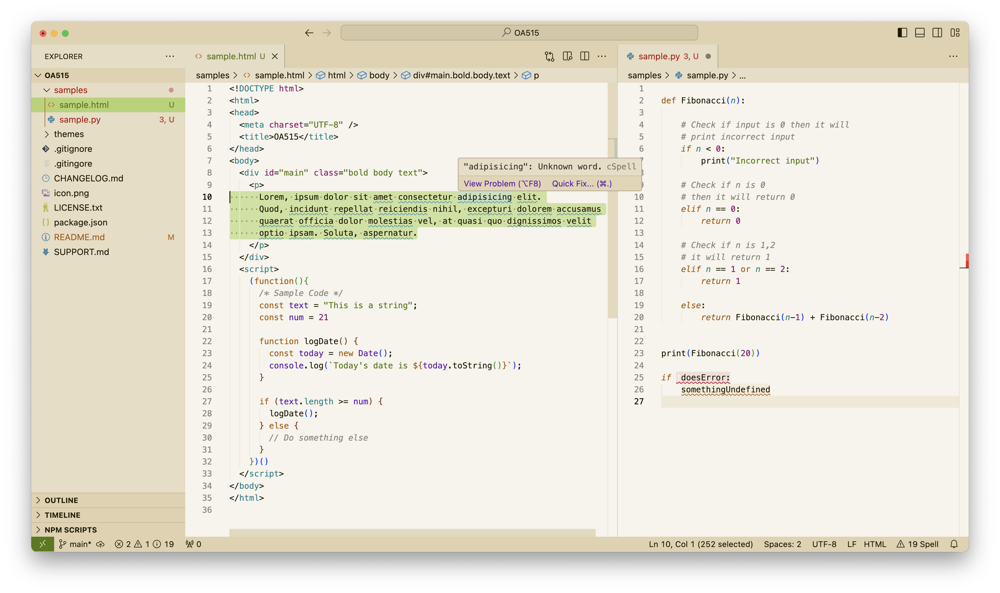

# OA515
An oasis in a desert of light themes.

## Themes
Most light themes are horrible. Pure black text on pure white backgrounds. When there are colours involved, they are subtle, or worse, suffer from either too much or too little contrast. OA515 is different. It's easy on the eyes and has a fun, readable palette. Perfect for coding on bright sunny days.

OA5I5 ("Oasis") has been my theme every day for the past couple of years. I've been tweaking it year after year and as a result it is stress-tested and supports most all VSCode features.

While the light theme is the heart of OA515, there's a matching dark theme to go along with it as well.

## Images

##### OA515 Light

##### OA515 Dark

## Attribution

- The font in the above screenshots is *Menlo*
- This theme was originally developed on themes.vscode.one

